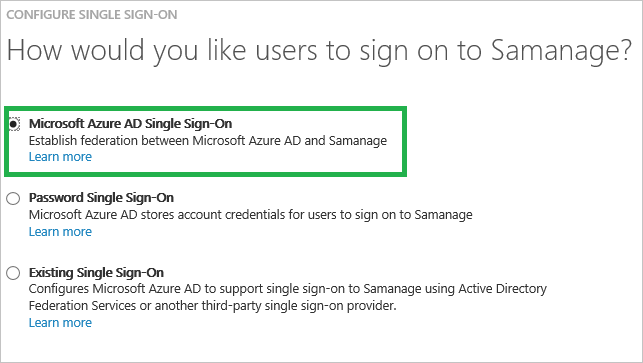
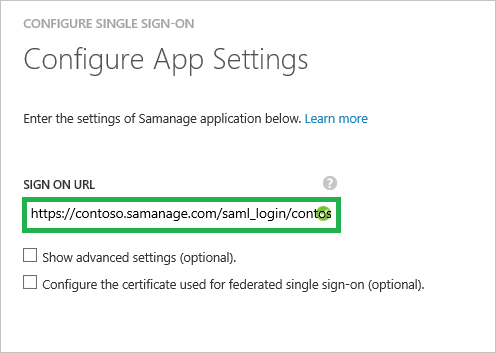
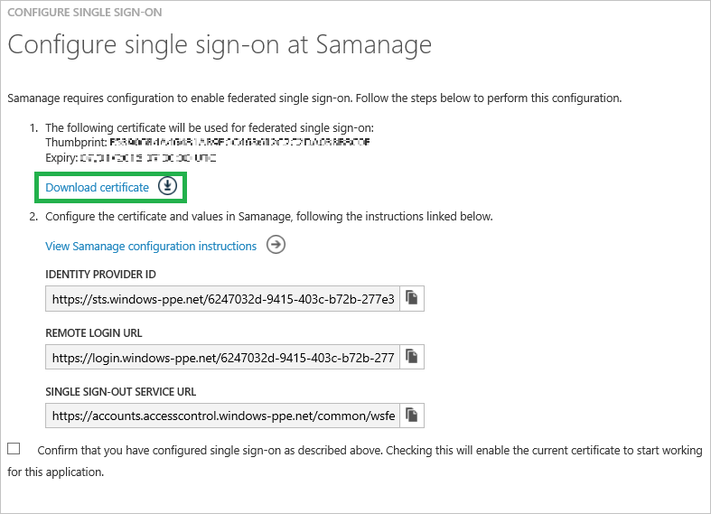
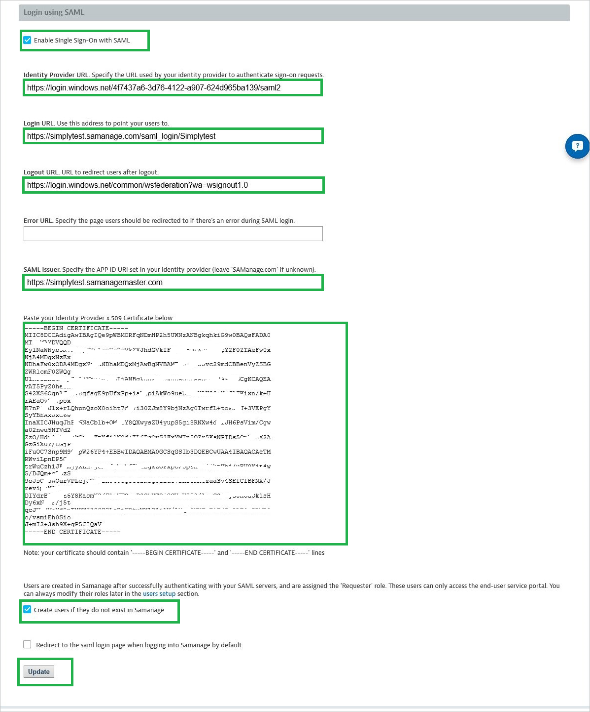
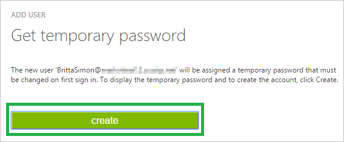
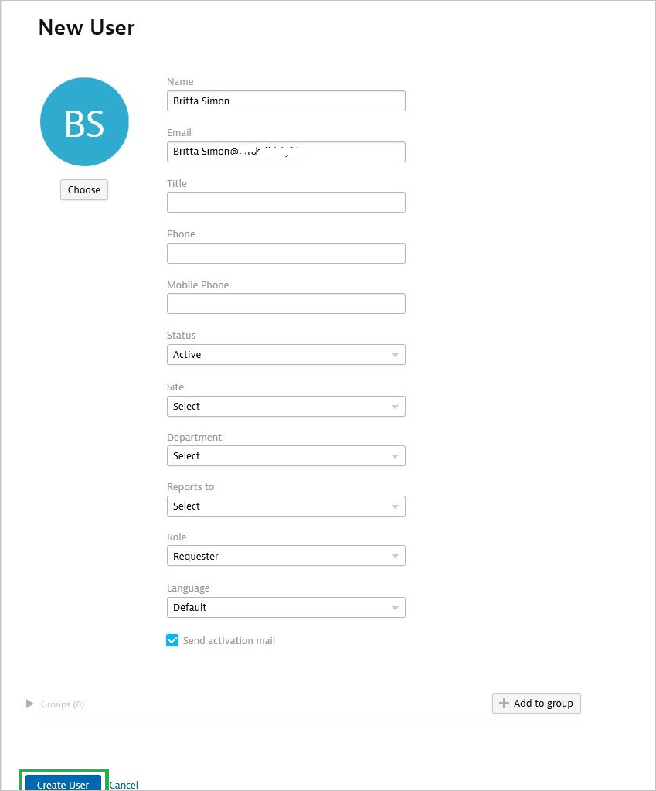

<properties 
    pageTitle="Tutorial: Azure Active Directory Integration with Samanage | Microsoft Azure" 
    description="Learn how to use Samanage with Azure Active Directory to enable single sign-on, automated provisioning, and more!" 
    services="active-directory" 
    authors="jeevansd"  
    documentationCenter="na" 
    manager="femila"/>
<tags 
    ms.service="active-directory" 
    ms.devlang="na" 
    ms.topic="article" 
    ms.tgt_pltfrm="na" 
    ms.workload="identity" 
    ms.date="08/15/2016" 
    ms.author="jeedes" />

# Tutorial: Azure Active Directory integration with Samanage
  
The objective of this tutorial is to show you how to integrate Samanage with Azure Active Directory (Azure AD).

Integrating Samanage with Azure AD provides you with the following benefits:

- You can control in Azure AD who has access to Samanage
- You can enable your users to automatically get signed-on to Samanage (Single Sign-On) with their Azure AD accounts
- You can manage your accounts in one central location - the Azure classic portal

If you want to know more details about SaaS app integration with Azure AD, see [What is application access and single sign-on with Azure Active Directory](active-directory-appssoaccess-whatis.md).

## Prerequisites

To configure Azure AD integration with Samanage, you need the following items:

- A valid Azure subscription
- A tenant in Samanage

> [AZURE.NOTE] To test the steps in this tutorial, we do not recommend using a production environment.

To test the steps in this tutorial, you should follow these recommendations:

- You should not use your production environment, unless this is necessary.
- If you don't have an Azure AD trial environment, you can get a one-month trial [here](https://azure.microsoft.com/pricing/free-trial/).

## Scenario description
The objective of this tutorial is to enable you to test Azure AD single sign-on in a test environment.

The scenario outlined in this tutorial consists of two main building blocks:

1. Adding Samanage from the gallery
2. Configuring and testing Azure AD single sign-on

## Adding Samanage from the gallery
To configure the integration of Samanage into Azure AD, you need to add Samanage from the gallery to your list of managed SaaS apps.

**To add Samanage from the gallery, perform the following steps:**

1.  In the Azure classic portal, on the left navigation pane, click **Active Directory**.

    

2.  From the **Directory** list, select the directory for which you want to enable directory integration.

3.  To open the applications view, in the directory view, click **Applications** in the top menu.

    

4.  Click **Add** at the bottom of the page.

    

5.  On the **What do you want to do** dialog, click **Add an application from the gallery**.

    

6.  In the **search box**, type **Samanage**.

    

7.  In the results pane, select **Samanage**, and then click **Complete** to add the application.

    

##  Configuring and testing Azure AD single sign-on
The objective of this section is to show you how to configure and test Azure AD single sign-on with Samanage based on a test user called "Britta Simon".

For single sign-on to work, Azure AD needs to know what the counterpart user in Samanage to an user in Azure AD is. In other words, a link relationship between an Azure AD user and the related user in Samanage needs to be established.

This link relationship is established by assigning the value of the **user name** in Azure AD as the value of the **Username** in Samanage.

To configure and test Azure AD single sign-on with Samanage, you need to complete the following building blocks:

1. **[Configuring Azure AD Single Sign-On](#configuring-azure-ad-single-single-sign-on)** - to enable your users to use this feature.
2. **[Creating an Azure AD test user](#creating-an-azure-ad-test-user)** - to test Azure AD single sign-on with Britta Simon.
3. **[Creating a Samanage test user](#creating-a-Samanage-test-user)** - to have a counterpart of Britta Simon in Samanage that is linked to the Azure AD representation of her.
4. **[Assigning the Azure AD test user](#assigning-the-azure-ad-test-user)** - to enable Britta Simon to use Azure AD single sign-on.
5. **[Testing Single Sign-On](#testing-single-sign-on)** - to verify whether the configuration works.

### Configuring Azure AD single sign-on
  
In this section, you enable Azure AD single sign-on in the classic portal and configure single sign-on in your Samanage application.

**To configure Azure AD single sign-on with Samanage, perform the following steps:**

1.  In the Azure classic portal, on the **Samanage** application integration page, click **Configure single sign-on** to open the **Configure Single Sign On** dialog.

    

2.  On the **How would you like users to sign on to Samanage** page, select **Microsoft Azure AD Single Sign-On**, and then click **Next**.

    

3.  On the Configure App Settings dialog page, perform the following steps:

    

    a. In the **Sign On URL** textbox, type a URL using the following pattern: `https://<Company Name>.samanage.com/saml_login/<Company Name>`.
	
	b. click **Next**

	> [AZURE.NOTE] Please note that these are not the real values. You have to update these values with the actual Sign On URL. To get these values, refer step 8.c for more details or contact Samanage.

4.  On the **Configure single sign-on at Samanage** page, click **Download certificate**, and then save the certificate file on your computer.

    

5.  In a different web browser window, log into your Samanage company site as an administrator.

6.  Click **Dashboard** and select **Setup** in left navigation pane.

    

7.  Click **Single Sign-On**.

    

8.  Navigate to **Login using SAML** section, perform the following steps:
    
    

    a.  Click **Enable Single Sign-On with SAML**.

    b.  In the **Identity Provider URL** textbox put the value of **Identity Provider ID** from Azure AD application configuration wizard.    

    c.  Confirm the **Login URL** matches the **Sign On URL** in step 3.

	d.  In the **Logout URL** textbox put the value of **Remote Logout URL** from Azure AD application configuration wizard.

    e. In the **SAML Issuer** textbox type the app id URI set in your identity provider.

	f.  Open your base-64 encoded certificate in notepad, copy the content of it into your clipboard, and then paste it to the **Paste your Identity Provider x.509 Certificate below** textbox.
    
	g.  Click **Create users if they do not exist in Samanage**.
    
	h.  Click **Update**.

9.  In the classic portal, select the single sign-on configuration confirmation, and then click **Next**.

    

10. On the **Single sign-on confirmation** page, click **Complete**.

	

### Creating an Azure AD test user

The objective of this section is to create a test user in the classic portal called Britta Simon.

**To create a test user in Azure AD, perform the following steps:**

1. In the **Azure classic Portal**, on the left navigation pane, click **Active Directory**.

    

2. From the **Directory** list, select the directory for which you want to enable directory integration.

3. To display the list of users, in the menu on the top, click **Users**.
    
	

4. To open the **Add User** dialog, in the toolbar on the bottom, click **Add User**.

    

5. On the **Tell us about this user** dialog page, perform the following steps:

    

    a. As Type Of User, select New user in your organization.

    b. In the User Name **textbox**, type **BrittaSimon**.

    c. Click **Next**.

6.  On the **User Profile** dialog page, perform the following steps:
    
	

    a. In the **First Name** textbox, type **Britta**.  

    b. In the **Last Name** textbox, type, **Simon**.

    c. In the **Display Name** textbox, type **Britta Simon**.

    d. In the **Role** list, select **User**.

    e. Click **Next**.

7. On the **Get temporary password** dialog page, click **create**.
    
	

8. On the **Get temporary password** dialog page, perform the following steps:
    
	

    a. Write down the value of the **New Password**.

    b. Click **Complete**.   

### Creating a Samanage test user
  
In order to enable Azure AD users to log into Samanage, they must be provisioned into Samanage.In the case of Samanage, provisioning is a manual task.

####To provision a user account, perform the following steps:

1.  Log into your Samanage company site as an administrator.

2.  Click **Dashboard** and select **Setup** in left navigation pan.

    

3.  Click the **Users** tab

    

4.  Click **New User**.

    

5.  Type the **Name** and the **Email Address** of an Azure AD account you want to provision and click **Create user**.

    

	>[AZURE.NOTE]The AAD account holder will receive an email and follow a link to confirm their account before it becomes active. You can use any other Samanage user account creation tools or APIs provided by Samanage to provision AAD user accounts.

###Assigning the Azure AD test user
  
The objective of this section is to enabling Britta Simon to use Azure single sign-on by granting her access to Samanage.
	

**To assign Britta Simon to Samanage, perform the following steps:**

1. On the classic portal, to open the applications view, in the directory view, click **Applications** in the top menu.
    
	

2. In the applications list, select **Samanage**.
    
	

3. In the menu on the top, click **Users**.
    
	

4. In the Users list, select **Britta Simon**.

5. In the toolbar on the bottom, click **Assign**.
    
	

### Testing single sign-on

The objective of this section is to test your Azure AD single sign-on configuration using the Access Panel.
 
When you click the Samanage tile in the Access Panel, you should get automatically signed-on to your Samanage application.

## Additional resources

* [List of Tutorials on How to Integrate SaaS Apps with Azure Active Directory](active-directory-saas-tutorial-list.md)
* [What is application access and single sign-on with Azure Active Directory?](active-directory-appssoaccess-whatis.md)