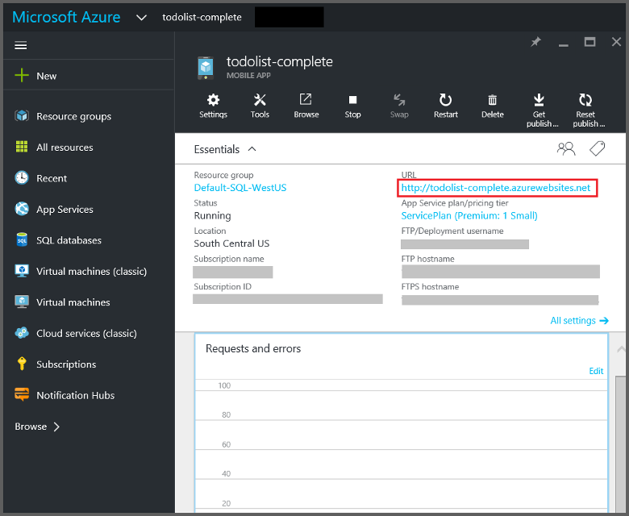
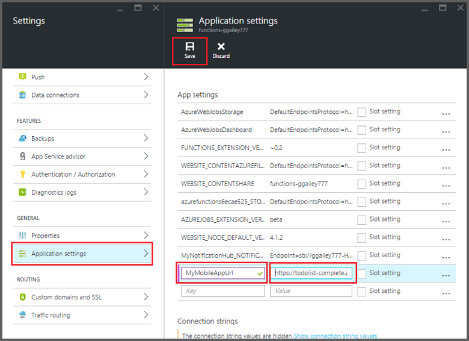

<properties
	pageTitle="Azure Functions Mobile Apps bindings | Microsoft Azure"
	description="Understand how to use Azure Mobile Apps bindings in Azure Functions."
	services="functions"
	documentationCenter="na"
	authors="ggailey777"
	manager="erikre"
	editor=""
	tags=""
	keywords="azure functions, functions, event processing, dynamic compute, serverless architecture"/>

<tags
	ms.service="functions"
	ms.devlang="multiple"
	ms.topic="reference"
	ms.tgt_pltfrm="multiple"
	ms.workload="na"
	ms.date="08/30/2016"
	ms.author="glenga"/>

# Azure Functions Mobile Apps bindings

[AZURE.INCLUDE [functions-selector-bindings](../../includes/functions-selector-bindings.md)]

This article explains how to configure and code Azure Mobile Apps bindings in Azure Functions. 

[AZURE.INCLUDE [intro](../../includes/functions-bindings-intro.md)] 

Azure App Service Mobile Apps lets you expose table endpoint data to mobile clients. This same tabular data can be used with both input and output bindings in Azure Functions. Because it supports dynamic schema, a Node.js backend mobile app is ideal for exposing tabular data for use with your functions. Dynamic schema is enabled by default and should be disabled in a production mobile app. For more information about table endpoints in a Node.js backend, see [Overview: table operations](../app-service-mobile/app-service-mobile-node-backend-how-to-use-server-sdk.md#TableOperations). In Mobile Apps, the Node.js backend supports in-portal browsing and editing of tables. For more information, see [in-portal editing](../app-service-mobile/app-service-mobile-node-backend-how-to-use-server-sdk.md#in-portal-editing) in the Node.js SDK topic. When you use a .NET backend mobile app with Azure Functions, you must manually update your data model as required by your function. For more information about table endpoints in a .NET backend mobile app, see [How to: Define a table controller](../app-service-mobile/app-service-mobile-dotnet-backend-how-to-use-server-sdk.md#define-table-controller) in the .NET backend SDK topic. 

## Create an environment variable for your mobile app backend URL

Mobile Apps bindings currently require you to create an environment variable that returns the URL of the mobile app backend itself. This URL can be found in the [Azure portal](https://portal.azure.com) by locating your mobile app and opening the blade.

To set this URL as an environment variable in your function app:

1. In your function app in the [Azure Functions portal](https://functions.azure.com/signin), click **Function app settings** > **Go to App Service settings**. 

	

2. In your function app, click **All settings**, scroll down to **Application settings**, then under **App settings** type a new **Name** for the environment variable, paste the URL into **Value**, making sure to use the HTTPS scheme, then click **Save** and close the function app blade to return to the Functions portal.   

	

You can now set this new environment variable as the *connection* field in your bindings.

##  Use an API key to secure access to your Mobile Apps table endpoints.

In Azure Functions, mobile table bindings let you specify an API key, which is a shared secret that can be used to prevent unwanted access from apps other than your functions. Mobile Apps does not have built-in support for API key authentication. However, you can implement an API key in your Node.js backend mobile app by following the examples in [Azure App Service Mobile Apps backend implementing an API key](https://github.com/Azure/azure-mobile-apps-node/tree/master/samples/api-key). You can similarly implement an API key in a [.NET backend mobile app](https://github.com/Azure/azure-mobile-apps-net-server/wiki/Implementing-Application-Key).

>[AZURE.IMPORTANT] This API key must not be distributed with your mobile app clients, it should only be distributed securely to service-side clients, like Azure Functions. 

##  Azure Mobile Apps input binding

Input bindings can load a record from a mobile table endpoint and pass it directly to your binding. The record ID is determined based on the trigger that invoked the function. In a C# function, any changes made to the record are automatically sent back to the table when the function exits successfully.

#### function.json for Mobile Apps input binding

The *function.json* file supports the following properties:

- `name` : Variable name used in function code for the new record.
- `type` : Biding type must be set to *mobileTable*.
- `tableName` : The table where the new record will be created.
- `id` : The ID of the record to retrieve. This property supports bindings similar to `{queueTrigger}`, which will use the string value of the queue message as the record Id.
- `apiKey` : String that is the application setting that specifies the optional API key for the mobile app. This is required when your mobile app uses an API key to restrict client access.
- `connection` : String that is the name of the environment variable in application settings that specifies the URL of your mobile app backend.
- `direction` : Binding direction, which must be set to *in*.

Example *function.json* file:

	{
	  "bindings": [
	    {
	      "name": "record",
	      "type": "mobileTable",
	      "tableName": "MyTable",
	      "id" : "{queueTrigger}",
	      "connection": "My_MobileApp_Url",
	      "apiKey": "My_MobileApp_Key",
	      "direction": "in"
	    }
	  ],
	  "disabled": false
	}

#### Azure Mobile Apps code example for a C# queue trigger

Based on the example function.json above, the input binding retrieves the record from a Mobile Apps table endpoint with the ID that matches the queue message string and passes it to the *record* parameter. When the record is not found, the parameter is null. The record is then updated with the new *Text* value when the function exits.

	#r "Newtonsoft.Json"	
	using Newtonsoft.Json.Linq;
	
	public static void Run(string myQueueItem, JObject record)
	{
	    if (record != null)
	    {
	        record["Text"] = "This has changed.";
	    }    
	}

#### Azure Mobile Apps code example for a Node.js queue trigger

Based on the example function.json above, the input binding retrieves the record from a Mobile Apps table endpoint with the ID that matches the queue message string and passes it to the *record* parameter. In Node.js functions, updated records are not sent back to the table. This code example writes the retrieved record to the log.

	module.exports = function (context, input) {    
	    context.log(context.bindings.record);
	    context.done();
	};

## Azure Mobile Apps output binding

Your function can write a record to a Mobile Apps table endpoint using an output binding. 

#### function.json for Mobile Apps output binding

The function.json file supports the following properties:

- `name` : Variable name used in function code for the new record.
- `type` : Binding type that must be set to *mobileTable*.
- `tableName` : The table where the new record is created.
- `apiKey` : String that is the application setting that specifies the optional API key for the mobile app. This is required when your mobile app uses an API key to restrict client access.
- `connection` : String that is the name of the environment variable in application settings that specifies the URL of your mobile app backend.
- `direction` : Binding direction, which must be set to *out*.

Example function.json:

	{
	  "bindings": [
	    {
	      "name": "record",
	      "type": "mobileTable",
	      "tableName": "MyTable",
	      "connection": "My_MobileApp_Url",
	      "apiKey": "My_MobileApp_Key",
	      "direction": "out"
	    }
	  ],
	  "disabled": false
	}

#### Azure Mobile Apps code example for a C# queue trigger

This C# code example inserts a new record into a Mobile Apps table endpoint with a *Text* property into the table specified in the above binding.

	public static void Run(string myQueueItem, out object record)
	{
	    record = new {
	        Text = $"I'm running in a C# function! {myQueueItem}"
	    };
	}

#### Azure Mobile Apps code example for a Node.js queue trigger

This Node.js code example inserts a new record into a Mobile Apps table endpoint with a *text* property into the table specified in the above binding.

	module.exports = function (context, input) {
	
	    context.bindings.record = {
	        text : "I'm running in a Node function! Data: '" + input + "'"
	    }   
	
	    context.done();
	};

## Next steps

[AZURE.INCLUDE [next steps](../../includes/functions-bindings-next-steps.md)]
