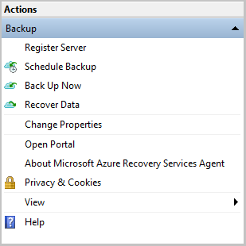
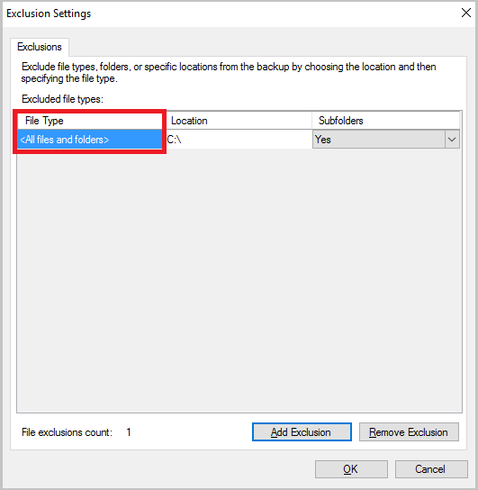
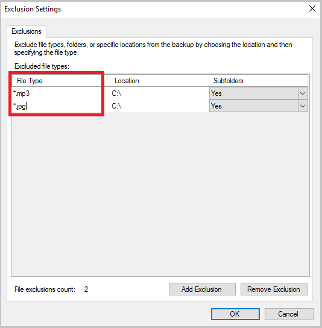

<properties
	pageTitle="Manage Azure Backup vaults and servers Azure using the classic deployment model | Microsoft Azure"
	description="Use this tutorial to learn how to manage Azure Backup vaults and servers."
	services="backup"
	documentationCenter=""
	authors="Jim-Parker"
	manager="jwhit"
	editor="tysonn"/>

<tags
	ms.service="backup"
	ms.workload="storage-backup-recovery"
	ms.tgt_pltfrm="na"
	ms.devlang="na"
	ms.topic="article"
	ms.date="06/15/2016"
	ms.author="jimpark;markgal"/>

# Manage Azure Backup vaults and servers using the classic deployment model

> [AZURE.SELECTOR]
- [Resource Manager](backup-azure-manage-windows-server.md)
- [Classic](backup-azure-manage-windows-server-classic.md)

In this article you'll find an overview of the backup management tasks available through the Azure classic portal and the Microsoft Azure Backup agent.

[AZURE.INCLUDE [learn-about-deployment-models](../../includes/learn-about-deployment-models-classic-include.md)] Resource Manager deployment model.

## Management portal tasks
1. Sign in to the [Management Portal](https://manage.windowsazure.com).

2. Click **Recovery Services**, then click the name of backup vault to view the Quick Start page.

    

By selecting the options at the top of the Quick Start page, you can see the available management tasks.

### Dashboard
Select **Dashboard** to see the usage overview for the server. The **usage overview** includes:

- The number of Windows Servers registered to cloud
- The number of Azure virtual machines protected in cloud
- The total storage consumed in Azure
- The status of recent jobs

At the bottom of the Dashboard you can perform the following tasks:

- **Manage certificate** - If a certificate was used to register the server, then use this to update the certificate. If you are using vault credentials, do not use **Manage certificate**.
- **Delete** - Deletes the current backup vault. If a backup vault is no longer being used, you can delete it to free up storage space. **Delete** is only enabled after all registered servers have been deleted from the vault.

## Registered items
Select **Registered Items** to view the names of the servers that are registered to this vault.

The **Type** filter defaults to Azure Virtual Machine. To view the names of the servers that are registered to this vault, select **Windows server** from the drop down menu.

From here you can perform the following tasks:

- **Allow Re-registration** - When this option is selected for a server you can use the **Registration Wizard** in the on-premises Microsoft Azure Backup agent to register the server with the backup vault a second time. You might need to re-register due to an error in the certificate or if a server had to be rebuilt.
- **Delete** - Deletes a server from the backup vault. All of the stored data associated with the server is deleted immediately.

    

## Protected items
Select **Protected Items** to view the items that have been backed up from the servers.

## Configure

From the **Configure** tab you can select the appropriate storage redundancy option. The best time to select the storage redundancy option is right after creating a vault and before any machines are registered to it.

>[AZURE.WARNING] Once an item has been registered to the vault, the storage redundancy option is locked and cannot be modified.

See this article for more information about [storage redundancy](../storage/storage-redundancy.md).

## Microsoft Azure Backup agent tasks

### Console

Open the **Microsoft Azure Backup agent** (you can find it by searching your machine for *Microsoft Azure Backup*).

From the **Actions** available at the right of the backup agent console you can perform the following management tasks:

- Register Server
- Schedule Backup
- Back Up now
- Change Properties

>[AZURE.NOTE] To **Recover Data**, see [Restore files to a Windows server or Windows client machine](backup-azure-restore-windows-server.md).

### Modify an existing backup

1. In the Microsoft Azure Backup agent click **Schedule Backup**.

    

2. In the **Schedule Backup Wizard** leave the **Make changes to backup items or times** option selected and click **Next**.

    

3. If you want to add or change items, on the **Select Items to Backup** screen click **Add Items**.

    You can also set **Exclusion Settings** from this page in the wizard. If you want to exclude files or file types read the procedure for adding [exclusion settings](#exclusion-settings).

4. Select the files and folders you want to back up and click **Okay**.

    

5. Specify the **backup schedule** and click **Next**.

    You can schedule daily (at a maximum of 3 times per day) or weekly backups.

    

    >[AZURE.NOTE] Specifying the backup schedule is explained in detail in this [article](backup-azure-backup-cloud-as-tape.md).

6. Select the **Retention Policy** for the backup copy and click **Next**.

    

7. On the **Confirmation** screen review the information and click **Finish**.

8. Once the wizard finishes creating the **backup schedule**, click **Close**.

    After modifying protection, you can confirm that backups are triggering correctly by going to the **Jobs** tab and confirming that changes are reflected in the backup jobs.

### Enable Network Throttling  
The Azure Backup agent provides a Throttling tab which allows you to control how network bandwidth is used during data transfer. This control can be helpful if you need to back up data during work hours but do not want the backup process to interfere with other internet traffic. Throttling of data transfer applies to back up and restore activities.  

To enable throttling:

1. In the **Backup agent**, click **Change Properties**.

2. Select the **Enable internet bandwidth usage throttling for backup operations** checkbox.

    

3. Once you have enabled throttling, specify the allowed bandwidth for backup data transfer during **Work hours** and **Non-work hours**.

    The bandwidth values begin at 512 kilobytes per second (Kbps) and can go up to 1023 megabytes per second (Mbps). You can also designate the start and finish for **Work hours**, and which days of the week are considered Work days. The time outside of the designated Work hours is considered to be non-work hours.

4. Click **OK**.

## Exclusion settings

1. Open the **Microsoft Azure Backup agent** (you can find it by searching your machine for *Microsoft Azure Backup*).

    

2. In the Microsoft Azure Backup agent click **Schedule Backup**.

    

3. In the Schedule Backup Wizard leave the **Make changes to backup items or times** option selected and click **Next**.

    

4. Click **Exclusions Settings**.

    

5. Click **Add Exclusion**.

    

6. Select the location and then, click **OK**.

    

7. Add the file extension in the **File Type** field.

    

    Adding an .mp3 extension

    

    To add another extension, click **Add Exclusion** and enter another file type extension (adding a .jpeg extension).

    

8. When you've added all the extensions, click **OK**.

9. Continue through the Schedule Backup Wizard by clicking **Next** until the **Confirmation page**, then click **Finish**.

    

## Next steps
- [Restore Windows Server or Windows Client from Azure](backup-azure-restore-windows-server.md)
- To learn more about Azure Backup, see [Azure Backup Overview](backup-introduction-to-azure-backup.md)
- Visit the [Azure Backup Forum](http://go.microsoft.com/fwlink/p/?LinkId=290933)
