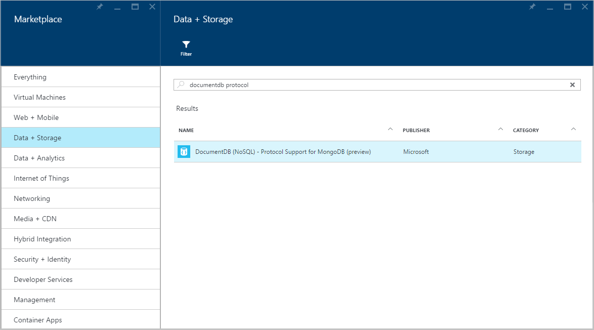
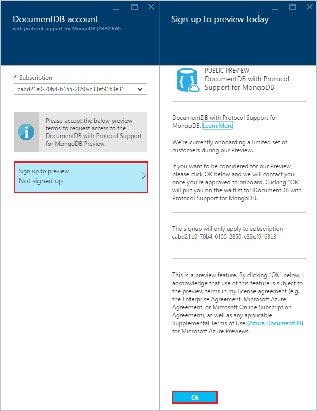
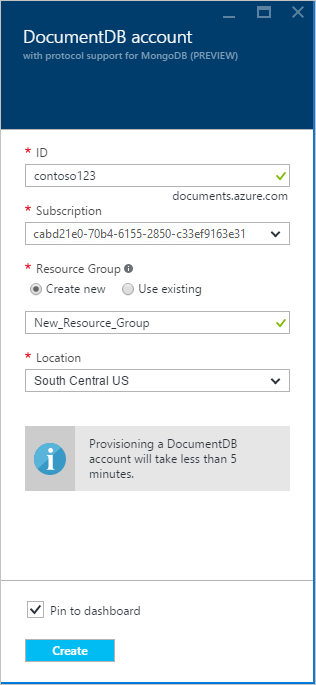

<properties 
	pageTitle="Create a DocumentDB account with protocol support for MongoDB | Microsoft Azure" 
	description="Learn how to create a DocumentDB account with protocol support for MongoDB, now available for preview." 
	services="documentdb" 
	authors="stephbaron" 
	manager="jhubbard" 
	editor="" 
	documentationCenter=""/>

<tags 
	ms.service="documentdb" 
	ms.workload="data-services" 
	ms.tgt_pltfrm="na" 
	ms.devlang="na" 
	ms.topic="article" 
	ms.date="08/23/2016" 
	ms.author="stbaro"/>

# How to create a DocumentDB account with protocol support for MongoDB using the Azure portal

To create an Azure DocumentDB account with protocol support for MongoDB, you must:

- Have an Azure account. You can get a [free Azure account](https://azure.microsoft.com/free/) if you don't have one already.

## Create the account  

To create a DocumentDB account with protocol support for MongoDB, perform the following steps.

1. In a new window, sign in to the [Azure Portal](https://portal.azure.com).
2. Click **NEW**, click **Data + Storage**, click **See all**, and then search the **Data + Storage** category for "DocumentDB protocol". Click **DocumentDB - Protocol Support for MongoDB**.

	

3. Alternatively, in the **Data + Storage** category, under **Storage**, click **More**, and then click **Load more** one or more times to display **DocumentDB - Protocol Support for MongoDB**. Click **DocumentDB - Protocol Support for MongoDB**.

	

4. In the **DocumentDB - Protocol Support for MongoDB (preview)** blade, click **Create** to launch the preview signup process.

	

5. In the **DocumentDB account** blade, click **Sign up to preview**. Read the information and then click **OK**.

	

6.  After accepting the preview terms, you will be returned to the create blade.  In the **DocumentDB account** blade, specify the desired configuration for the account.

	

	- In the **ID** box, enter a name to identify the account.  When the **ID** is validated, a green check mark appears in the **ID** box. The **ID** value becomes the host name within the URI. The **ID** may contain only lowercase letters, numbers, and the '-' character, and must be between 3 and 50 characters. Note that *documents.azure.com* is appended to the endpoint name you choose, the result of which will become your account endpoint.

	- For **Subscription**, select the Azure subscription that you want to use for the account. If your account has only one subscription, that account is selected by default.

	- In **Resource Group**, select or create a resource group for the account.  By default, an existing Resource group under the Azure subscription will be chosen.  You may, however, choose to select to create a new resource group to which you would like to add the account. For more information, see [Using the Azure portal to manage your Azure resources](resource-group-portal.md).

	- Use **Location** to specify the geographic location in which to host the account.
   
	- Check **Pin to dashboard** 

7.	Once the new account options are configured, click **Create**.  It can take a few minutes to create the account.  To check the status, you can monitor the progress on the Startboard.  
	  

	Or, you can monitor your progress from the Notifications hub.  

	  

	

8.	After the account is created, it is ready for use with the default settings. 

	
	

## Next steps

- Learn how to [connect](documentdb-connect-mongodb-account.md) to a DocumentDB account with protocol support for MongoDB.

 
