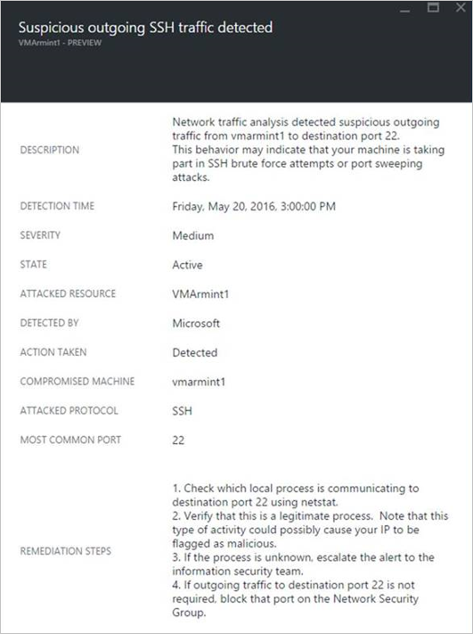
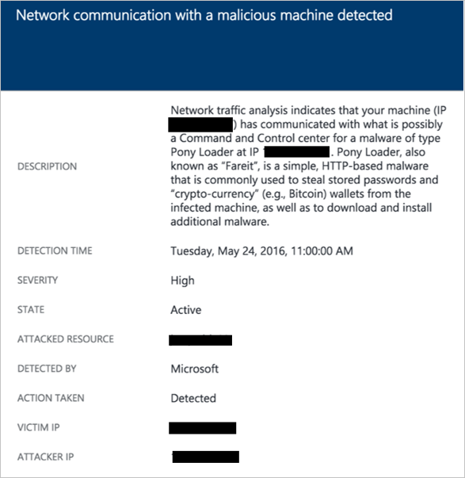
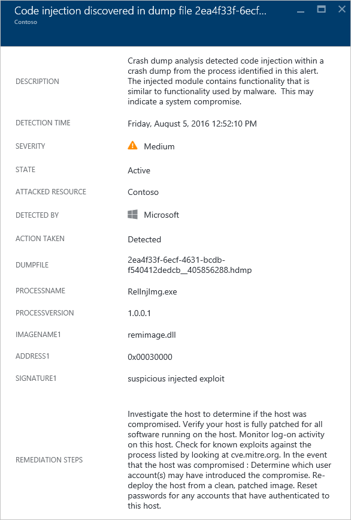
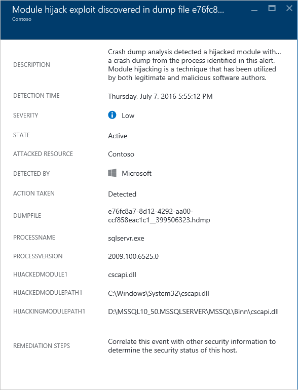
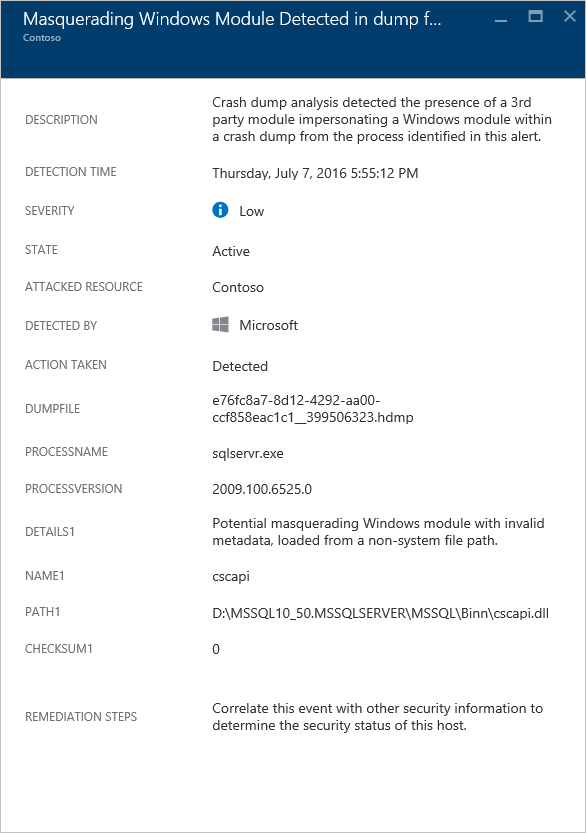

<properties
   pageTitle="Managing and responding to security alerts in Azure Security Center | Microsoft Azure"
   description="This document helps you to use Azure Security Center capabilities to manage and respond to security alerts."
   services="security-center"
   documentationCenter="na"
   authors="YuriDio"
   manager="swadhwa"
   editor=""/>

<tags
   ms.service="security-center"
   ms.topic="hero-article"
   ms.devlang="na"
   ms.tgt_pltfrm="na"
   ms.workload="na"
   ms.date="08/26/2016"
   ms.author="yurid"/>

# Managing and responding to security alerts in Azure Security Center
This document helps you use Azure Security Center to manage and respond to security alerts.

> [AZURE.NOTE] To enable advanced detections, upgrade to Azure Security Center Standard. A free 90-day trial is available. To upgrade, select Pricing Tier in the [Security Policy](security-center-policies.md). See the [pricing page](https://azure.microsoft.com/pricing/details/security-center/) to learn more.

## What are security alerts?
Security Center automatically collects, analyzes, and integrates log data from your Azure resources, the network, and connected partner solutions, like firewall and endpoint protection solutions, to detect real threats and reduce false positives. A list of prioritized security alerts is shown in Security Center along with the information you need to quickly investigate the problem and recommendations for how to remediate an attack. Azure Security Center also aggregates alerts that align to kill chain patterns into [Incidents](security-center-incident.md). 

> [AZURE.NOTE] For more information about how Security Center detection capabilities work, read [Azure Security Center Detection Capabilities](security-center-detection-capabilities.md).

## Managing security alerts

You can review your current alerts by looking at the **Security alerts** tile. Open Azure Portal and follow the steps below to see more details about each alert:

1. On the Security Center dashboard, you will see the **Security alerts** tile.

    

2.  Click the tile to open the **Security alerts** blade that contains more details about the alerts as shown below.

    

In the bottom part of this blade are the details for each alert. To sort, click the column that you want to sort by. The definition for each column is given below:

- **Alert**: A brief explanation of the alert.
- **Count**: A list of all alerts of this specific type that were detected on a specific day.
- **Detected by**: The service that was responsible for triggering the alert.
- **Date**: The date that the event occurred.
- **State**: The current state for that alert. There are two types of states:
    - **Active**: The security alert has been detected.
    - **Dismissed**: The security alert has been dismissed by the user. This status is typically used for alerts that have been investigated but either mitigated or found not to be an actual attack.

- **Severity**: The severity level, which can be high, medium or low.

### Filtering alerts

You can filter alerts based on date, state, and severity. Filtering alerts can be useful for scenarios where you need to narrow the scope of security alerts show. For example, you might you want to address security alerts that occurred in the last 24 hours because you are investigating a potential breach in the system.

1. Click **Filter** on the **Security Alerts** blade. The **Filter** blade opens and you select the date, state, and severity values you wish to see.

	

2. 	After investigating a security alert, you may find that it is a false positive for your environment or indicates an expected behavior for a particular resource. Whatever the case may be, if you determine that a security alert is not applicable, you can dismiss the alert and then filter it out of your view. There are two ways to dismiss a security alert. Right click an alert and select **Dismiss** or hover over an item, click the three dots that appear to the right, and select **Dismiss**. You can view dismissed security alerts by clicking **Filter** and selecting **Dismissed**.

	

### Respond to security alerts

Select a security alert to learn more about the event(s) that triggered the alert and what, if any, steps you need to take to remediate an attack. Security alerts are grouped by type and date. Clicking a security alert will open a blade containing a list of the grouped alerts.

In this case, the alerts that were triggered refer to suspicious Remote Desktop Protocol (RDP) activity. The first column shows which resources were attacked; the second shows how many times the resource was attacked; the third shows the time of the attack; the fourth shows state of the alert; and the fifth shows the severity of the attack. After reviewing this information, click the resource that was attacked and a new blade will open.

In the **Description** field of this blade you will find more details about this event. These additional details offer insight into what triggered the security alert, the target resource, when applicable the source IP address, and recommendations about how to remediate.  In some instances, the source IP address will be empty (not available) because not all Windows security events logs include the IP address.

> [AZURE.NOTE] The remediation suggested by Security Center will vary according to the security alert. In some cases, you may have to use other Azure capabilities to implement the recommended remediation. For example, the remediation for this attack is to blacklist the IP address that is generating this attack by using a [network ACL](../virtual-network/virtual-networks-acl.md) or a [network security group](../virtual-network/virtual-networks-nsg.md) rule.

## Security alerts by type
The same steps that were used to access the suspicious RDP activity alert can be used to access other type of alerts. Here are some other examples of alerts that you may see in Security Center alerts:

### Potential SQL Injection
SQL injection is an attack in which malicious code is inserted into strings that are later passed to an instance of SQL Server for parsing and execution. Any procedure that constructs SQL statements should be reviewed for injection vulnerabilities because SQL Server will execute all syntactically valid queries that it receives. 

 

This alert gives information that enables you to identify the attacked resource, the detection time, the state of the attack and it also provides a link to further investigation steps.

### Suspicious outgoing traffic detected

Network devices can be discovered and profiled in much the same way as other types of systems. Attackers usually start with port scanning / port sweeping. In the example below you have a suspicious SSH traffic from a VM that can be performing a SSH brute force or port sweeping attack against an external resource. 

This alert gives information that enables you to identify the resource that was used to initiate this attack, the compromised machine, the detection time, the protocol and port that was used. This blade also gives you a list of remediation steps that can be used to mitigate this issue.

### Network communication with a malicious machine
 
By leveraging Microsoft threat intelligence feeds, Azure Security Center can detect compromised machines that are communicating with malicious IP addresses, in many cases a command and control center. In this case Azure Security Center detected that the communication was done using Pony Loader malware (also known as [Fareit](https://www.microsoft.com/security/portal/threat/encyclopedia/entry.aspx?Name=PWS:Win32/Fareit.AF)).

This alert gives information that enables you to identify the resource that was used to initiate this attack, the attacked resource, the victim IP, the attacker IP and the detection time.

> [AZURE.NOTE] Live IP addresses were removed from this screenshot for privacy purpose.

### Shellcode Discovered 

Shellcode is the payload that is run after malware has exploited a software vulnerability.  This alert indicates that crash dump analysis has detected executable code exhibiting behavior commonly performed by malicious payloads.  Although non-malicious software may perform this behavior, it is not typical of normal software development practices. 

The following fields are common to all crash dump alerts:

- DUMPFILE: Name of the crash dump file 
- PROCESSNAME: Name of the crashing process 
- PROCESSVERSION: Version of the crashing process 

This alert provides the following additional field:

- ADDRESS: The location in memory of the shellcode

This is an example of this type of alert:

### Code Injection Discovered

Code injection is the insertion of executable modules into running processes or threads.  This technique is used by malware to access data, hide or prevent its removal (e.g. persistence).  This alert indicates the crash dump analysis has detected an injected module with the crash dump.
 
Legitimate software developers occasionally perform code injection for non-malicious reasons, such as modifying or extending an existing application or operating system component.  To help differentiate between malicious and non-malicious injected modules, Azure Security Center checks whether or not the injected module conforms to a profile of suspicious behavior. The result of this check is indicated by the “SIGNATURE” field of the alert and is reflected in the severity of the alert, alert description, and alert remediation steps.  

In addition to the common fields described in the “Shellcode Discovered” section above, this alert provides the following additional fields:

- ADDRESS: The location in memory of the injected module
- IMAGENAME: The name of the injected module. Note that this can be blank if the image name is not provided within the image.
- SIGNATURE: Indicates if the injected module conforms to a profile of suspicious behavior.The following table shows examples of results and their description:

| **Signature value**                  | **Description**                                                                                                   |
|--------------------------------------|-------------------------------------------------------------------------------------------------------------------|
| Suspicious reflective loader exploit | This suspicious behavior often correlates with loading injected code independently of the operating system loader |
| Suspicious injected exploit          | Signifies maliciousness that often correlates to injecting code into memory                                       |
| Suspicious injecting exploit         | Signifies maliciousness that often correlates to use of injected code in memory                                   |
| Suspicious injected debugger exploit | Signifies maliciousness that often correlates to detection or circumvention of a debugger                         |
| Suspicious injected remote exploit   | Signifies maliciousness that often correlates to command n control (C2) scenarios                                 |

This is an example of this type of alert:

### Module Hijacking Discovered

Windows relies on Dynamic Link Libraries (DLLs) to allow software to utilize common Windows system functionality.  DLL Hijacking occurs when malware changes the DLL load order to load malicious payloads into memory, where arbitrary code can be executed. This alert indicates the crash dump analysis has detected a similarly named module is loaded from two different paths, where one of the loaded paths comes from a common Windows system binary location.

Legitimate software developers occasionally change the DLL load order for non-malicious reasons, such as instrumenting, extending the Windows OS or Windows applications.  To help differentiate between malicious and potentially benign changes to the DLL load order, Azure Security Center checks whether or not a loaded module conforms to a suspicious profile.   The result of this check is indicated by the “SIGNATURE” field of the alert and is reflected in the severity of the alert, alert description, and alert remediation steps.  Analyzing the on disk copy of the hijacking module, such as by verifying the files digital signature or running an anti-virus scan, may provide more information as to the legitimate or malicious nature of the hijacking module.

In addition to the common fields described in the “Shellcode Discovered” section above, this alert provides the following fields:

- SIGNATURE: Indicates if the hijacking module conforms to a profile of suspicious behavior
- HIJACKEDMODULE: The name of the hijacked Windows system module
- HIJACKEDMODULEPATH: The path of the hijacked Windows system module
- HIJACKINGMODULEPATH: The path of the hijacking module 

This is an example of this type of alert:

### Masquerading Windows Module Detected

Malware may use common names of Windows system binaries (e.g., SVCHOST.EXE) or modules (e.g., NTDLL.DLL) in order to “blend-in” and obscure the nature of the malicious software from system administrators.  This alert indicates the crash dump analysis has detected that the crash dump file contains modules that use Windows system module names, but do not satisfy other criteria that are typical of Windows modules. Analyzing the on disk copy of the masquerading module may provide more information as to the legitimate or malicious nature of this module. Analysis may include:

- Confirm that the file in question is shipped as part of a legitimate software package
- Verify the file’s digital signature 
- Run an anti-virus scan on the file

In addition to the common fields described in the “Shellcode Discovered” section above, this alert provides the following additional fields:

- DETAILS: Describes whether the modules metadata is valid and whether the module was loaded from a system path.
- NAME: The name of the masquerading Windows module
- PATH: The path to the masquerading Windows module.

This alert also extracts and displays the certain fields, from the module’s PE header, such as “CHECKSUM” and “TIMESTAMP”.  These fields are only displayed if the fields are present in the module. See the [Microsoft PE and COFF Specification](https://msdn.microsoft.com/windows/hardware/gg463119.aspx) for details on these fields.

This is an example of this type of alert:

### Modified System Binary Discovered 

Malware may modify core system binaries in order to covertly access data or surreptitiously persist on a compromised system.  This alert indicates the crash dump analysis has detected that core Windows OS binaries have been modified in memory or on disk. 

Legitimate software developers occasionally modify system modules in memory for non-malicious reasons, such as Detours or for application compatibility. To help differentiate between malicious and potentially legitimate modules, Azure Security Center checks whether or not the modified module conforms to a suspicious profile.   The result of this check is indicated by the severity of the alert, alert description, and alert remediation steps. 

In addition to the common fields described in the “Shellcode Discovered” section above, this alert provides the following additional fields:

- MODULENAME: Name of the modified system binary 
- MODULEVERSION: Version of the modified system binary

This is an example of this type of alert:

## See also

In this document, you learned how to configure security policies in Security Center. To learn more about Security Center, see the following:

- [Handling Security Incident in Azure Security Center](security-center-incident.md)
- [Azure Security Center Detection Capabilities](security-center-detection-capabilities.md)
- [Azure Security Center Planning and Operations Guide](security-center-planning-and-operations-guide.md)
- [Azure Security Center FAQ](security-center-faq.md) — Find frequently asked questions about using the service.
- [Azure Security blog](http://blogs.msdn.com/b/azuresecurity/) — Find blog posts about Azure security and compliance.
